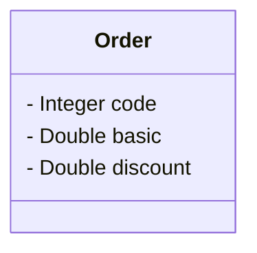

#  Java Spring Professional - Desafio 01

#### Desenvolvido na linguagem Java por:
- [Marcos Shirafuchi](https://github.com/marcosfshirafuchi)
## Formação Desenvolvedor Moderno Módulo: Back end
Capítulo: Componentes e injeção de dependência

## DESAFIO: Componentes e injeção de dependência

Você deve criar um sistema para calcular o valor total de um pedido, considerando uma porcentagem
de desconto e o frete. O cálculo do valor total do pedido consiste em aplicar o desconto ao valor
básico do pedido, e adicionar o valor do frete. A regra para cálculo do frete é a seguinte:

<table>
  <thead>
    <tr align="left">
      <th>Valor básico do pedido (sem desconto)</th>
      <th>Frete</th>
    </tr>
  </thead>
  <tbody align="left">
    <tr>
      <td>Abaixo de R$ 100.00 
      </td>
      <td>R$ 20.00
      </td>
    </tr>
    <tr>
      <td>De R$ 100.00 até R$ 200.00 exclusive 
      </td>
      <td>R$ 12.00</td>
    </tr>
    <tr>
      <td>R$ 200.00 ou mais</td>
      <td>Grátis</td>   
    </tr>
  </tbody>
  <tfoot></tfoot>
</table>

## Exemplo 1:
<table>
  <thead>
    <tr align="left">
      <th>ENTRADA (dados do pedido: código, valor básico, porcentagem de desconto)</th>
      <th>SAÍDA</th>
    </tr>
  </thead>
  <tbody align="left">
    <tr>
      <td>1034 
      150.00 
      20.0</td>
      <td>Pedido código 1034 
          Valor total: R$ 132.00
      </td>
    </tr>
   
  </tbody>
  <tfoot></tfoot>
</table>

## Exemplo 2:
<table>
  <thead>
    <tr align="left">
      <th>ENTRADA (dados do pedido: código, valor básico, porcentagem de desconto)</th>
      <th>SAÍDA</th>
    </tr>
  </thead>
  <tbody align="left">
    <tr>
      <td>2282 
          800.00 
          10.0
      </td>
      <td>
          Pedido código 2282 
          Valor total: R$ 720.00
      </td>
    </tr>
   
  </tbody>
  <tfoot></tfoot>
</table>

## Exemplo 3:
<table>
  <thead>
    <tr align="left">
      <th>ENTRADA (dados do pedido: código, valor básico, porcentagem de desconto)</th>
      <th>SAÍDA</th>
    </tr>
  </thead>
  <tbody align="left">
    <tr>
      <td>
          1309 
          95.90 
          0.0
      </td>
      <td>
        Pedido código 1309 
        Valor total: R$ 115.90
      </td>
    </tr>
   
  </tbody>
  <tfoot></tfoot>
</table>

Sua solução deverá seguir as seguintes especificações: 
Um pedido deve ser representado por um objeto conforme projeto abaixo: 

A lógica do cálculo do valor total do pedido deve ser implementada por componentes (serviços), cada
um com sua responsabilidade, conforme projeto abaixo:  

 
 
Serviço OrderService: responsável por operações referentes a pedidos. 
Serviço ShippingService: responsável por operações referentes a frete.  
Sua solução deverá ser implementada em Java com Spring Boot. A saída deverá ser mostrada no log
do terminal da aplicação. Cada serviço deve ser implementado como um componente registrado com
@Service.
